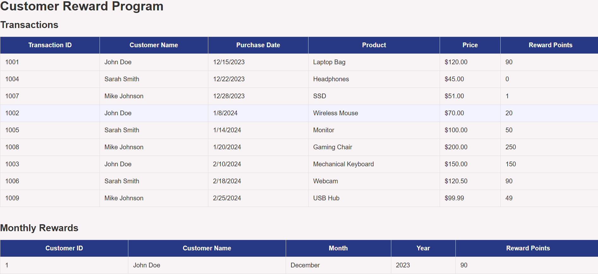
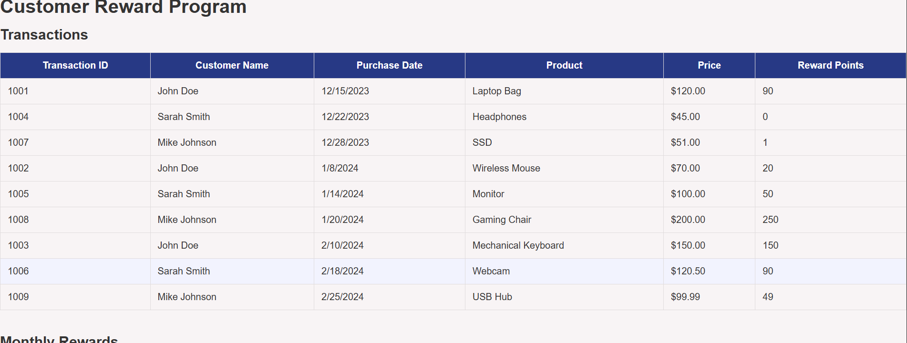
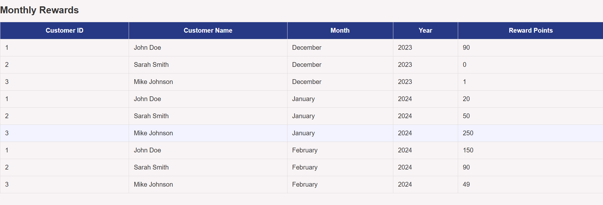
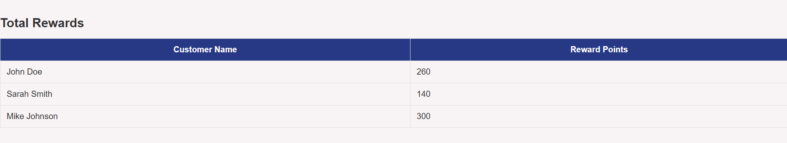

# Customer Reward Program

A production-ready React application that calculates and displays customer reward points based on purchase transactions over a three-month period.

---

## Objective

A retailer offers a rewards program to its customers based on every recorded purchase.

Reward calculation rules:

* No rewards for purchases of **$50 or less**
* **1 point** for every dollar spent **between $50 and $100**
* **2 points** for every dollar spent **over $100**

### Example

Purchase Amount: **$120**

Reward Points:

* $50-$100 → 50 points
* Above $100 → 20 × 2 = 40 points

**Total Reward Points = 90**

---

# Features

* Display all customer transactions
* Calculate reward points for every transaction
* Display monthly rewards for each customer
* Display total rewards for each customer
* Aggregate rewards by **Month** and **Year**
* Handle transactions across multiple years
* Sort transactions by purchase date
* Support decimal purchase amounts
* Loading, Empty and Error states
* Responsive reusable table component
* Pure utility functions
* Unit testing
* ESLint and Prettier configuration
* Feature-based folder structure

---

# Technology Stack

* React 19
* Vite
* JavaScript (ES6+)
* React Hooks
* PropTypes
* Vitest
* React Testing Library
* ESLint
* Prettier

---

# Project Structure

```text
src/
│
├── assets/
|__ config/ 
│
├── features/
│   └── rewards/
│       ├── components/
│       ├── columns/
│       ├── hooks/
│       ├── services/
│       ├── constants.js
│       └── index.js
│
├── shared/
│   ├── components/
│   └── layouts/
│
├── utils/
│
├── constants/
│
├── data/
│
├── styles/
│
└── tests/
```

---

# Application Screens

The application contains three tables.

## 1. Transactions

| Column            |
| ----------------- |
| Transaction ID    |
| Customer Name     |
| Purchase Date     |
| Product Purchased |
| Purchase Amount   |
| Reward Points     |

---

## 2. Monthly Rewards

| Column        |
| ------------- |
| Customer ID   |
| Customer Name |
| Month         |
| Year          |
| Reward Points |

---

## 3. Total Rewards

| Column              |
| ------------------- |
| Customer Name       |
| Total Reward Points |

---

# Reward Calculation

```
Purchase <= 50
Reward = 0
```

```
Purchase = 70

70 - 50 = 20

Reward = 20
```

```
Purchase = 100

Reward = 50
```

```
Purchase = 120

Reward

50-100 = 50 points

100-120 = 20 × 2 = 40 points

Total = 90
```

---

# Reward Calculation Examples

| Purchase | Reward |
| -------: | -----: |
|       40 |      0 |
|       50 |      0 |
|       70 |     20 |
|       90 |     40 |
|      100 |     50 |
|      120 |     90 |
|      150 |    150 |

---

# Handling Decimal Purchases

Fractional purchase amounts are ignored while calculating reward points.

Examples

| Purchase | Reward |
| -------: | -----: |
|    100.2 |     50 |
|    100.4 |     50 |
|    100.9 |     50 |

---

# Application Flow

1. Load transactions from a simulated asynchronous API.
2. Sort transactions by purchase date.
3. Calculate reward points for every transaction.
4. Aggregate rewards by customer, month and year.
5. Calculate total rewards for each customer.
6. Render the three tables.

---

# Design Decisions

The project follows a feature-based architecture to improve scalability and maintainability.

Business logic is separated from UI components.

Reusable components are used wherever possible.

Pure utility functions are placed outside React components to avoid unnecessary recreation during rendering.

Sorting is performed during data processing instead of storing sorted data in component state.

No Redux is used. React Hooks are sufficient for this application.

---

# Error Handling

The application includes:

* Loading state
* Empty state
* Error state

Unexpected errors are handled gracefully.

---

# Testing

Unit tests are written using:

* Vitest
* React Testing Library

Tests cover:

* Reward calculation
* Reward aggregation
* Table rendering
* Utility functions
* React components

Run tests

```bash
npm test
```

---

# Installation

Clone the repository

```bash
git clone <repository-url>
```

Navigate to the project

```bash
cd customer-rewards-program
```

Install dependencies

```bash
npm install
```

Start the application

```bash
npm run dev
```

Build for production

```bash
npm run build
```

---

# Coding Standards

* React Functional Components
* JavaScript ES6+
* No TypeScript
* No Redux
* Feature-based architecture
* Pure functions
* Reusable components
* ESLint
* Prettier
* PropTypes validation
* Meaningful naming conventions

---

# Assumptions

* Purchases less than or equal to $50 earn no reward points.
* Fractional purchase values do not contribute to reward calculations.
* Reward calculations are performed independently for every transaction.
* Monthly rewards are grouped by both month and year.
* Transactions may span multiple calendar years.

---

# Future Improvements

* Search customers
* Filter by date range
* Pagination
* Export to CSV
* Server-side API integration
* Dark mode
* Internationalization (i18n)

---

# Screenshots

Include screenshots for:

* Home page

* Transactions table

* Monthly rewards table

* Total rewards table


---

# Author

Nisanth Alex
Senior Frontend Engineer
